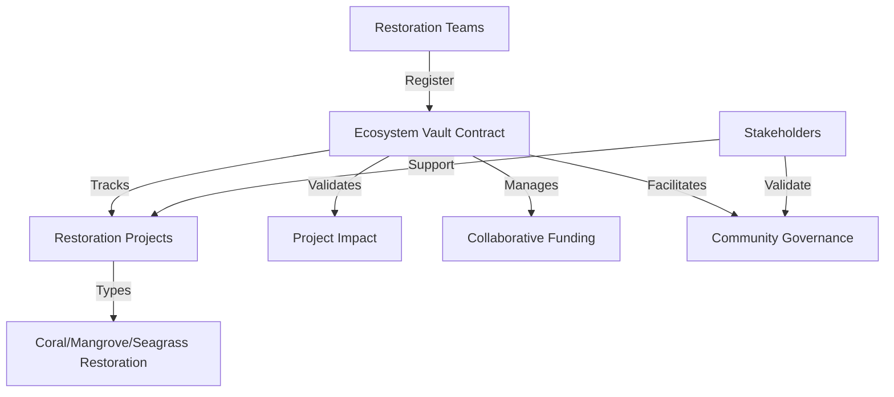

# Restore Apparatus

A decentralized platform for tracking, verifying, and incentivizing marine ecosystem restoration efforts globally.

## Overview

Restore Apparatus is a blockchain-powered platform that empowers marine conservation teams by providing:
- Immutable tracking of restoration project metadata
- Verifiable impact measurement and reporting
- Transparent collaboration mechanisms
- Community-driven validation system
- Incentive structures for successful restoration initiatives

The platform connects marine restoration experts, environmental organizations, and global stakeholders in a transparent ecosystem where conservation efforts are rigorously documented and validated.

## Architecture

The system is built around a primary smart contract that manages:



### Core Components:
- Restoration Team Registry
- Project Impact Tracking
- Validation Mechanism
- Collaborative Funding
- Community Governance

## Contract Documentation

### ecosystem-vault.clar

The main contract handling restoration project tracking and validation.

#### Key Features:
- Restoration team registration
- Project metadata storage
- Impact measurement tracking
- Transparent validation process
- Community governance mechanism

#### Restoration Types:
- `RESTORATION-TYPE-CORAL` (u1): Coral reef restoration
- `RESTORATION-TYPE-MANGROVE` (u2): Mangrove ecosystem restoration
- `RESTORATION-TYPE-SEAGRASS` (u3): Seagrass meadow restoration

## Getting Started

### Prerequisites
- Clarinet
- Stacks wallet for deployment/interaction

### Basic Usage

1. Register as a researcher:
```clarity
(contract-call? .ocean-vault register-researcher "John Doe" "Marine Institute" "PhD Marine Biology")
```

2. Register a dataset:
```clarity
(contract-call? .ocean-vault register-dataset 
    "dataset-001"
    "Coral Reef Survey 2023"
    "Environmental Data"
    "Great Barrier Reef"
    u1683849600
    "Standard sampling methodology"
    0x... ;; data hash
    u1    ;; open access
    u0    ;; free
)
```

3. Access a dataset:
```clarity
(contract-call? .ocean-vault check-dataset-access "dataset-001" tx-sender)
```

## Function Reference

### Public Functions

#### Researcher Management
- `register-researcher`: Register a new researcher
- `get-researcher`: Retrieve researcher information

#### Dataset Management
- `register-dataset`: Register a new dataset
- `verify-dataset`: Verify a dataset (admin only)
- `get-dataset`: Retrieve dataset information

#### Access Control
- `grant-dataset-access`: Grant access to permissioned dataset
- `access-paid-dataset`: Purchase access to paid dataset
- `check-dataset-access`: Check access permissions

#### Citations
- `cite-dataset`: Cite a dataset in research
- `get-citation`: Retrieve citation information

#### Governance
- `create-proposal`: Create a governance proposal
- `vote-on-proposal`: Vote on active proposals
- `finalize-proposal`: Finalize proposal after voting period

## Development

### Testing
1. Clone the repository
2. Install Clarinet
3. Run tests:
```bash
clarinet test
```

### Local Development
1. Start Clarinet console:
```bash
clarinet console
```
2. Deploy contracts:
```clarity
(contract-call? .ocean-vault ...)
```

## Security Considerations

### Access Control
- Only registered researchers can register datasets
- Dataset access is strictly controlled based on type
- Paid access requires successful STX transfer
- Permission grants only by dataset owners

### Governance
- Only registered researchers can participate
- Proposals have fixed voting periods
- Vote counting is transparent and immutable
- Status changes are permanent once finalized

### Limitations
- On-chain storage limited to metadata
- Actual dataset storage should be off-chain
- Access control applies to metadata only
- Citations must be by registered researchers